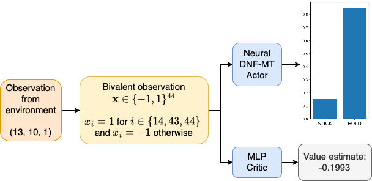
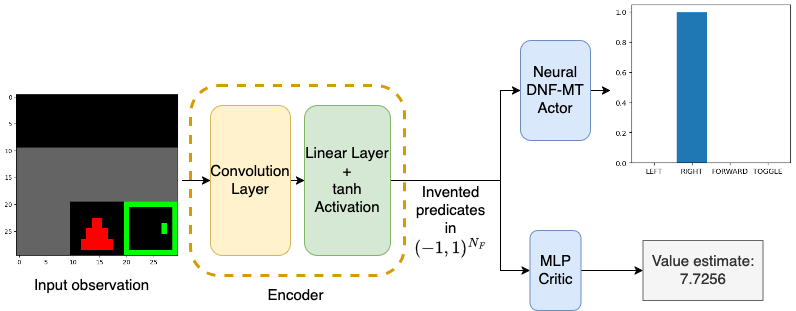
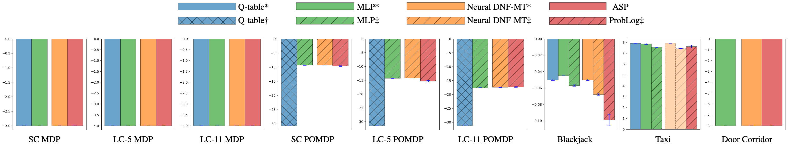

# Neural DNF-MT: A Neuro-symbolic Approach for Learning Interpretable and Editable Policies

This repository contains the RL code for the paper "Neural DNF-MT: A
Neuro-symbolic Approach for Learning Interpretable and Editable Policies" in
[AAMAS 2025](https://plibin.github.io/aamas-25-proceedings/pdfs/p252.pdf). The
full paper with appendix can be found on
[arXiv](https://arxiv.org/abs/2501.03888).

We introduce a novel neuro-symbolic approach, Neural DNF-MT, for learning
policies in reinforcement learning. The neural DNF-MT can be trained in
end-to-end fashion with deep actor-critic algorithms, and it provides
interpretability via post-training logical translation.





**Useful Links**

- [Poster](figures/poster.pdf)

- [5-min introduction video](https://www.youtube.com/watch?v=6_MFEDeN1cQ)


## Requirements

Our custom libraries:

* Neural DNF package [`neural-dnf`](https://github.com/kittykg/neural-dnf)

* Corridor environment package [`corridor-grid`](https://github.com/kittykg/corridor-grid)

We recommend cloning the custom libraries and then installing in editable mode.

Other essential libraries are listed in `requirements.txt` .

## Experiment Running Instructions

We use Hydra to manage configurations. We refer new users to the [Hydra
documentation](https://hydra.cc/docs/intro/) for more information on how to use
Hydra. The configuration files are located in `conf/` . The main configuration
file is `conf/config.yaml` .

Most training configurations in `conf/training` are the final hyperparameters we
used in the paper, although some might differ. For the actual hyperparameters
used in the paper, please refer to the paper's Appendix.

We use [Weight and Biases](https://wandb.ai/site) for logging. We refer new
users to the [WandB documentation](https://docs.wandb.ai/) for more information
on how to use WandB. To enable logging, you need to set up your own project and
API key. To disable wandb logging, set the hydra config `wandb.use_wandb` to
`False` .

We also support Discord webhook for notification. To disable it, set the hydra
config `webhook.use_discord_webhook` to `False` .

To run a training script, you can use the following command:

```bash
python <training_script> <hydra_config_overrides>
```

For example:

```bash
# run the script without wandb and discord notification
python door_corridor_ppo.py training=door_corridor_ppo_ndnf_mt \
    wandb.use_wandb=False webhook.use_discord_webhook=False
```

To run an evaluation script, you can use the following command:

```bash
python <evaluation_script> <hydra_config_overrides>
```

For example:

```bash
# run the script without discord notification
python eval/door_corridor_ppo_multirun_rl_performance_eval.py \
    +eval=door_corridor_ppo_ndnf_mt_multirun_eval \
    webhook.use_discord_webhook=False
```

We only list out the training and evaluation scripts for each environment. In
`eval/` directory, we have another `README.md` file that lists out the detailed
usage of each evaluation script.

### Switcheroo Corridor Scripts

For training:

* `ss_corridor_tabular.py`: Q-table (supports both Q-learning and SARSA)

* `ss_corridor_ppo.py`: Actor-critic PPO (supports MLP and neural DNF-based
  actors)

For evaluation:

* `eval/ss_corridor_tabular_multirun_eval.py`: MDP + POMDP - Q-table evaluation

* `eval/ss_corridor_ppo_multirun_rl_performance.py`: MDP + POMDP - PPO MLP
  actors evaluation

* `eval/ss_corridor_ppo_ndnf_multirun_eval.py`: MDP - PPO neural DNF-based
  actors evaluation + post-training processing

* `eval/ss_corridor_asp_rules_inference.py`: MDP - ASP rules inference

* `eval/ss_corridor_ppo_pomddp_ndnf_multirun_eval.py` POMDP - PPO neural
  DNF-based actors evaluation + post-training

* `eval/ss_corridor_ppo_pomdp_ndnf_mt_post_train_interpretation.py`: POMDP - PPO
  neural DNF-MT actors ProbLog rule extraction

* `eval/ss_corridor_pomdp_problog_rules_inference.py`: POMDP - Problog rules
  inference

### Blackjack Scripts

For training:

* `blackjack_tabular.py`: Q-table (supports both Q-learning and SARSA, not used
  for the paper since we use the baseline Q-table from [SB20])

* `blackjack_ppo.py`: Actor-critic PPO (supports MLP and neural DNF-based
  actors)

For evaluation:

* `eval/blackjack_tabular_snb_eval.py` - evaluation of the baseline Q-table from
  [SB20]

* `eval/blackjack_ppo_multirun_rl_performance_eval.py` - PPO actors evaluation
  (MLP + neural DNF-based actors)

* `eval/blackjack_ppo_ndnf_mt_post_train_soft_extraction.py` - neural DNF-MT
  actor post-training processing

* `eval/blackjack_ppo_ndnf_mt_post_train_interpretation.py` - neural DNF-MT
  actor ProbLog rule extraction

* `eval/blackjack_problog_rules_inference.py` - Problog rules inference

### Taxi Scripts

For training:

* `taxi_tabular.py`: Q-table (supports both Q-learning and SARSA)

* `taxi_ppo.py`: Actor-critic PPO (supports MLP and neural DNF-based actors,
  although the neural DNF-based actor is not used in the paper)

* `taxi_distillation.py`: Distillation of neural DNF-based actors

For evaluation:

* `eval/taxi_tabular_multirun_eval.py`: Q-table evaluation

* `eval/taxi_ppo_multirun_rl_performance.py`: PPO MLP actors evaluation

* `eval/taxi_distillation_multirun_rl_performance_eval.py`: Distilled neural
  DNF-based actors evaluation

* `eval/taxi_distillation_ndnf_mt_post_train_soft_extraction.py`: Distilled
  neural DNF-MT actor post-training processing

* `eval/taxi_distillation_ndnf_mt_post_train_interpretation.py`: Distilled
  neural DNF-MT actor ProbLog rule extraction

* `eval/taxi_problog_rules_inference.py`: Problog rules inference

### Door Corridor Scripts

For training:

* `door_corridor_ppo.py`: Actor-critic PPO (supports MLP and neural DNF-based
  actors)

For evaluation:

* `eval/door_corridor_ppo_multirun_rl_performance.py`: PPO actors evaluation
  (MLP + neural DNF-based actors)

* `eval/door_corridor_ppo_ndnf_mt_multirun_eval.py`: PPO neural DNF-MT
  post-training processing

* `eval/door_corridor_asp_rules_inference.py`: ASP rules inference

Policy intervention:

* `notebooks/Door Corridor PPO NDNF-MT-6731 Intervention.ipynb`: Notebook for
  policy intervention with neural DNF-MT actor in DC-T and DC-OT

## Results



For detailed results in table, please refer to the full paper's Appendix D.


### Reproducibility

For detailed hyperparameters, please refer to the full paper's Appendix D. The
seeds we used should be in the eval yaml files in `conf/eval/`.


## Citation

TODO

## References

[SB20] R. Sutton and A. Barto, “Reinforcement Learning: An Introduction” 2020.
[Online]. Available: http://www.incompleteideas.net/book/RLbook2020.pdf
